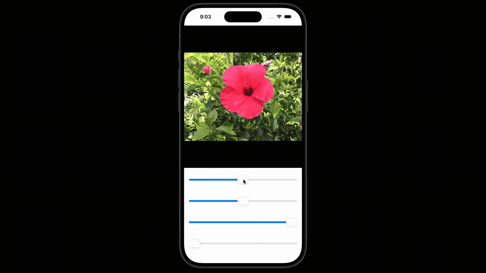
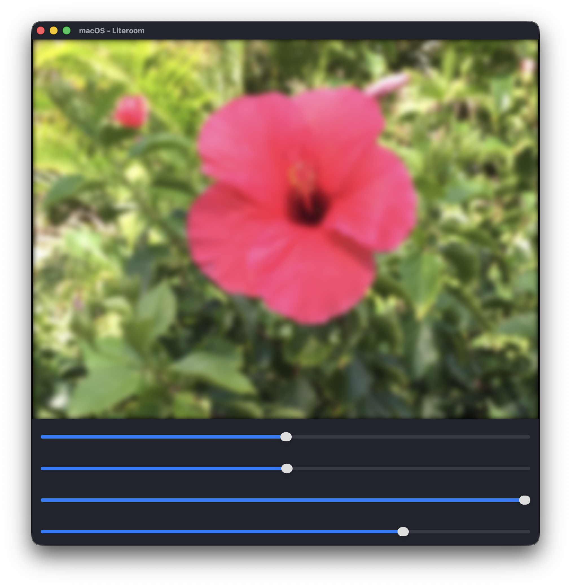

# 📷 Literoom

An image editing application made with Metal and SwiftUI. This project was built as my introduction to compute shaders and pipelines, as well as to learn image processing techniques.

## 📝 Features

- A compute pipeline supporting modular filters for image adjustments, including brightness, contrast, saturation, and Gaussian blur
- Optimized image processing with ping-pong rendering for multipass filters and the dirty flag pattern to appropriately trigger redraws
- An application layer with SwiftUI, with sliders passing state to Metal for real-time interaction

## 🔍 What I Learned

- Configuring a compute pipeline supporting multiple passes and threadgroups for dispatching using an explicit graphics API
- Mathematical foundations behind image processing techniques, including convolutions, seperable kernels, Gaussian distributions, and color space transformations
- Creating applications for Apple devices using SwiftUI, including the use of state to pass data between the renderer and application

## 🖼️ Results

### Brightness

### Contrast

### Saturation

### Gaussian Blur

